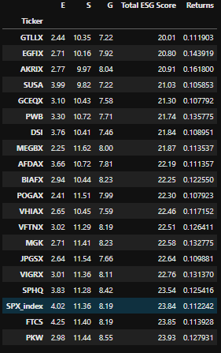

# Columbia Fintech Bootcamp - Project 1
*Using Python and JupyterLab to Analyze Data*

# Sustainable Investing vs Index Fund Investing 

## Team Members:
- David Still
- Anton Diez
- Akshay Jindal
- Moses Devanesan

# Topic of the Analysis:
Is there a price to be paid by investing in ESG mutual funds? How do mutual funds with high sustainability ratings perform against the S&P 500? 

# Hypothesis:
 Actively managed mutual funds tend to underperform passively managed or index funds on a regular basis. 
 
S&P Down Jones Indices released a report in 2019 and found that 85.1% of actively managed large-cap funds lagged the S&P 500 over a 10 year period:

Since sustainable funds need to be actively managed in order to select companies that meet certain criteria, our team surmised that at least 50% of the sustainable funds will underperform the S&P 500 over a 10 year period. 

If an investor feels that sustainable investing is important, how much will it cost them in returns? Will investors in sustainable funds have to deal with lower performance and higher volatility? 

# How We Performed the Analysis

Barron's provided a list of the large-cap mutual funds that received an "above average" or "high" sustainability rating from Morningstar. 

Taking this information from Barron's, our group compiled the daily closing prices from 2010-2020 from Bloomberg to see how these funds performed over a 10 year time period. To further our analysis, the group collected the ESG rankings and various value & growth measures (i.e. P/E ratio, risk rating) from Morningstar to better understand some of the characteristics of the sustainable funds. 

Altogether the team utlized 4 different data sets from Barron's, Morningstar and Bloomberg. This data was then concatenated into one dataframe to do our analysis. 

# Data Cleanup & Exploration
The exploration process was challenging because we wanted access to data that typically required a paid subscription. Fortunately we were able to leverage colleagues and free trials to collect the necessary data. 

We first started by pre-procesing the data. We removed extra columns that were not needed, dropped any rows that had null or missing values and renamed columns that had unnecessary or confusing symbols. Since our data came from many different sources, each one had different pre-processing requirements.  

After pre-processing the data, the first issue that we needed to address was ensuring that we set the ticker symbols as index when we created the individual dataframes. If we did not do this, then we could not concatenate all the dataframes. This was not too challenging.

The biggest issue that we faced was that the dataframes would still not concatenate properly even after ensuring that indexes were the same. After several hours of trial and error, we eventually found that one of the CSV files contained spaces *before and after* the ticker symbol. Naturally, none of us considered that a well-known data provider would include unncessary spaces before and after the ticker symbols. Had we examined the CSV files more carefully we could have potentially caught this earlier.

# Data Analysis
### Below are the questions we seeked to answer:
 
1. How do mutual funds with strong ESG investment policies compare to respective benchmark (i.e S&P 500)? 
2. What is the relationship between fund performance and standard deviation of the Top 20 Funds?
3. How did the Sharpe ratios compare for the top 20 performing funds?
4. What is the correlation between the Top 20 performing funds?
5. How does EPS growth, returns and the P/E Ratio compare for all the mutual funds?
6. What are the various fund categories of the list of 129 mutual funds? Do they all employ value or growth strategies?
7. What is the average risk rating for each fund category? We assume that growth strategies are riskier than value ones.
8. How do the E, S and G components of ESG score respectively?
9. Of the funds that outperform the index, which of the sustainability metrics do the funds score highest in?
10. How do the top 20 sustainable funds ESG scores compare to the S&P 500?

# Summarizing Major Findings

1. How do mutual funds with strong ESG investment policies compare to respective benchmark (i.e S&P 500)?

    Out of 129 funds that we analyzed, the S&P 500 had the 13th highest annual return between 2010 and 2020 at 11.2%. 

2. What is the relationship between fund performance and standard deviation of the Top 20 Funds?

   - The best performing funds tended to have lower annual standard deviations while the lower performing fund had higher standard deviations.
   - The S&P 500 had a lower annual standard deviation than about half the funds.
   - Akre Focus Fund, ticker symbol AKRIK, not only had the highest annual returns but  also had the lowest annual standard deviation. This fund does not have a sustainable mandate, but rather concentrates in fewer positions.

3. How did the Sharpe ratios show for the top 20 funds?

    - AKRIX had the highest sharpe ratio at 1.18. This fund’s rare combination of high returns and lower standard deviation set it apart from    the others. 
    - The S&P 500 performed fairly well compared to the top 20 as well. It’s ranking was the 10th highest.  

4. What is the correlation between the Top 20 Funds?

    - The correlation among the top 20 funds was quite high.
    -  The lowest correlation between the any two funds, AKRIX and SUSA, was 0.84. AKRIX was the best performing fund in the group while SUSA was worst performing, indicating less overlap among portfolio holdings. 

5. What is the comparison of EPS Growth, Returns, P/E Ratio for all Mutual Funds?

     - Projected EPS growth and P/E Forward are correlated. 
     - Akre Focus Fund, ticker symbol AKRIK, has a relatively high P/E Forward ratio and Projected EPS Growth. 
     - Performance is not necessarily driven by high multiples.

6. What are the various fund categories of the list of 128 mutual funds?

     - In total, Morningstar contains 64 different category types. The data provided from Barron's list contained only 3 different type of fund categories. 
     - The funds are broken into different peer groups when deciding the type of the fund category. Peer groups by definition contain similar holdings.
     - The Barron's list contains three different types of fund categories: Large Blend, Large Value, Large Growth.
     - By category breakdown, the list provided by Barrons contains around the same number of Large Growth  and Large Blend funds at 39%. The remaining 22% funds were categorized under Large Value. 
      
     
    
    
     

7. What is the average risk rating for each fund category?

    - Morningstar risk rating ranks publicly traded mutual funds and ETFs based on the fund’s past performance.
    - Funds with less than three years of performance history are not rated.
    - We quantified each risk rating by assocating each level of risk with a numerical value between 1-5. The value of 1 will represent the low risk while 5 represents high risk.
    - While we can see that there is not much variation between the average risk of the different fund categories, the Large Growth fund category will have the least amount of risk.
    - The average risk rating for all the fund categories fall at 1.86. This means that the list of funds provided by Barron rates low average and below average risk.
 

8. How do E, S and G values compare to each other?

     - The total ESG score is broken down into three parts: Environmental, Social, and Governance policies. The overall score is calculated based on the weighting of the three individual scores.
     - Environmental criteria considers how a company impacts nature and the environment.
     - Social criteria considers how a company manages its relationships with its customers, suppliers, employees, and the communities where it opperates.  
     - Governance criteria considers internal controls, audits, leadership of the company, shareholder rights, and executive pay.
     - A low score indiciates less risk while a high score implies greater risk.
     - Generally, the environmental rating has the lowest risk among the three metrics as evidenced by the chart below. This is likely due to the fact that companies are facing greater pressure from governments worldwide to lower their envinronmental footprint. 

9. Of the funds that outperform the index, which of the sustainability metrics do the funds score highest in?

    - There is the least variation within the Governance category, and it also has the most outliers.
    - From anaylzing the data, the governance and social metric values contain outliers compared to the respected mean. When examining the boxplot below, the "G" governance metric has 6 values above its total range. The "S"  social metric has 6 values fall below the total range.

10. How does the top 20 sustainable funds ESG scores compare to the S&P 500?

    - The S&P500 has the 18th highest total ESG score among the top 20 funds.
    - Not only did the S&P500 have the 13th highest annual return, its ESG rating scored relatively well compared to the other top 20 performing sustainable funds. 
    
    

# Discussion

## Three big takeaways: 

To reiterate from the anaylsis above, out of 129 funds that we analyzed, the S&P 500 had the 13th highest annual return between 2010 and 2020 at 11.2%. The average return for the entire group was 6.9%. Confirming the research from S&P Dow Jones Indicies report most investors would of faired poorly if they chose to invest in a actively managed fund over the index.

Prior to our research, we assumed the list provided by Barron only incorperated funds that had sustainable mandates. After our anaylsis, we learned that only 5 out of 20 top performing mutual funds actually had sustainable mandates. This means that investors do not need to explicity invest in mutual funds with sustainable mandates in order to acheive their desired investment criteria. 

S&P 500 index has comparable ESG ratings compared to the top 20 funds. This surprised us because the index comprises companies from many different industries. This would seem to indiciate that many companies within the S&P500 index are already implementing ESG policies.

# Interactive Investing Tool

Sources:
  
  1. https://www.cnbc.com/2019/03/15/active-fund-managers-trail-the-sp-500-for-the-ninth-year-in-a-row-in-triumph-for-indexing.html
  2. https://www.cnbc.com/2019/03/15/active-fund-managers-trail-the-sp-500-for-the-ninth-year-in-a-row-in-triumph-for-indexing.html
  3. https://www.morningstar.com/
  4. https://www.barrons.com/articles/top-esg-funds-our-annual-ranking-finds-sustainable-funds-are-increasingly-beating-the-market-51579301101
